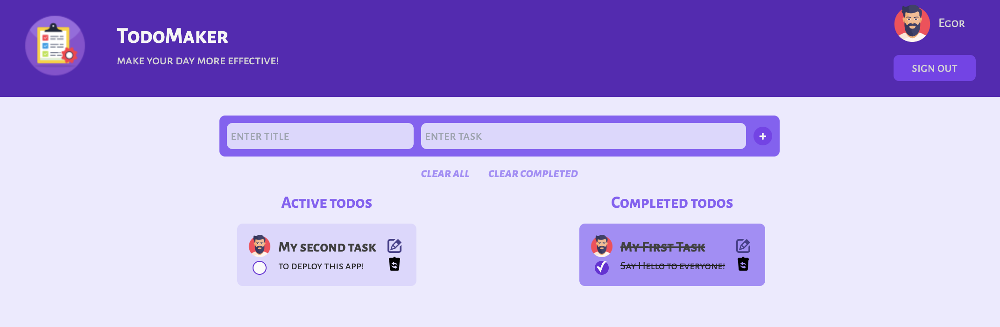

## TodoMaker

***

***

### Description

<i>Simple SPA about your daily routine:
- includes two blocks:
    * [LoginForm](#films);
    * [Todos](#news);
- __header__ for logout and opportunity to choose avatar;
- __footer__ for contacts;

***

#### `LoginForm`
<i>Starter default is LoginForm includes two forms:_
 * form with login and password to enter;
 * form to add new user;

powered by __Supabase API__.

If you have account, you can enter or you also have an opportunity to 
create new account!

***

#### `Todos`
The main content of SPA with standard options:
 * add new todo;
 * complete todo;
 * update todo;
 * delete todo;
powered by __Supabase API__!</i>

***

### Tech Stack

* [x] HTML;
* [x] TypeScript;
* [x] CSS/SCSS;
* [x] Tailwind CSS;
* [x] React JS;
* [x] Redux Toolkit;

***

### Contacts

For feedback:`Gambit47@yandex.ru` 
Deployed:`kino-monstr-1za9vg0b8-gorgeousgeorge90.vercel.app`
